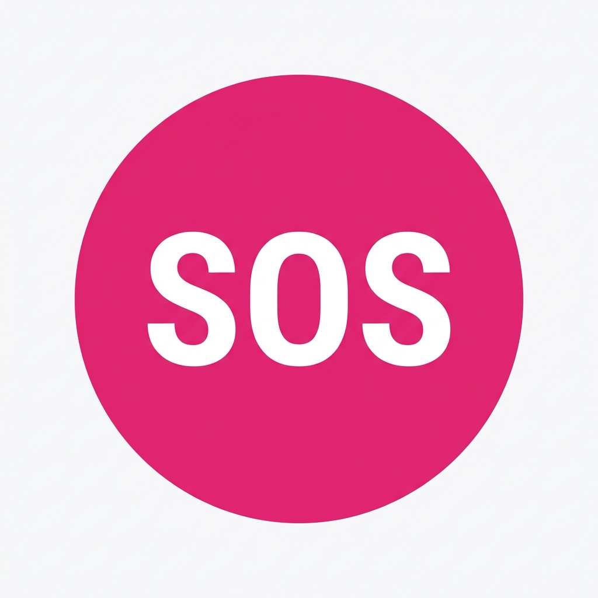

# InstantDRS (Instant Disaster Response System) 🚨

> **"Turning Chaos into Clarity with Multimodal AI & High-Performance Triage"**

InstantDRS is a production-grade emergency response platform designed for the **2026 Google Solution Challenge**. It solves the critical "Triage Lag" by utilizing Google Gemini 1.5 Flash to analyze multimodal emergency signals (Images, Video, Audio) and a high-performance C++ Priority Engine for sub-millisecond dispatch sorting.



## 🌟 Why it Wins
- **Multimodal AI**: Uses Gemini 1.5 Flash to "see" and "hear" emergencies, providing tactical summaries and unit recommendations.
- **Hybrid Performance**: Combines Python's flexibility with a C++ Priority Engine (Merge Sort) for enterprise-scale incident management.
- **Low-Power Protocol**: Built-in "Battery Smart" mode that strips heavy UI elements when the reporter's device is below 15% charge.
- **Satellite-Ready**: Lightweight JSON payloads and offline-first IndexedDB storage for areas with poor connectivity.

## 🛠️ Technical Stack
- **Frontend**: Vanilla JS, TailwindCSS, Glassmorphism UI.
- **Backend**: Python Flask (Production Hardened).
- **AI Engine**: Google Gemini 1.5 Flash (JSON Schema Parsing).
- **Core Engine**: C++17 (Priority Sorting Algorithm).
- **Database**: Firebase Firestore (Real-time Command Center Sync).

## 🚀 Getting Started

### Prerequisites
- Python 3.10+
- G++ Compiler (for Priority Engine)
- Google Gemini API Key

### Installation
1. Clone the repository.
2. Install dependencies:
   ```bash
   pip install -r requirements.txt
   ```
3. Compile the Priority Engine:
   ```bash
   # Windows
   .\compile.bat
   # Linux/Mac
   ./compile.sh
   ```
4. Configure your `.env`:
   ```bash
   cp .env.example .env
   # Add your GEMINI_API_KEY to .env
   ```
5. Run the server:
   ```bash
   python app.py
   ```

## 🔐 Authority Dashboard
Access the **Command Center** at `/authority`. 
- **Default Username**: `admin`
- **Default Password**: `InstantDRS2026` (Configurable via `ADMIN_PASSWORD` env var)

## 📁 Repository Structure
- `app.py`: Main Flask application & AI Bridge.
- `priority_engine.cpp`: C++ Source for the sorting algorithm.
- `templates/`: Professional UI templates.
- `static/`: Assets, CSS, and Service Workers.
- `Dockerfile`: Containerization for Google Cloud Run.

---
**InstantDRS** is built to save lives. It's not just a hackathon project; it's a blueprint for the future of emergency dispatch.
